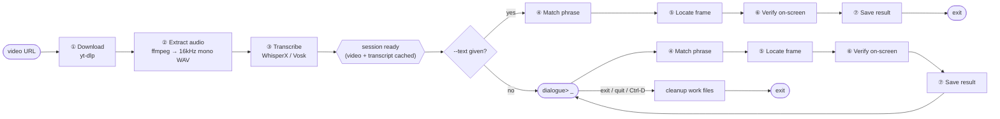
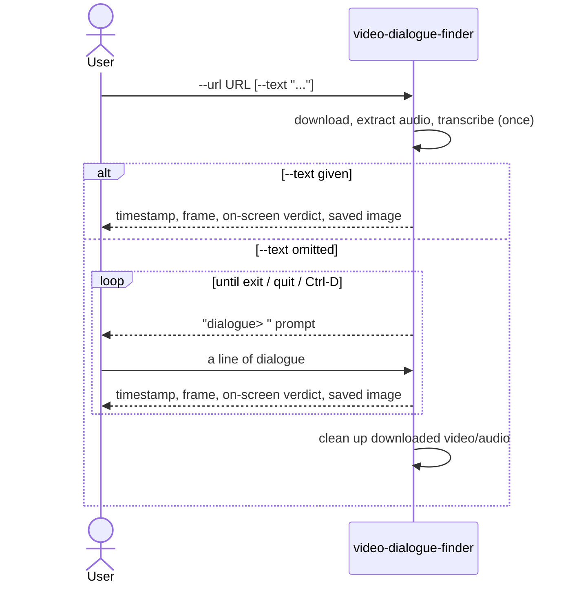
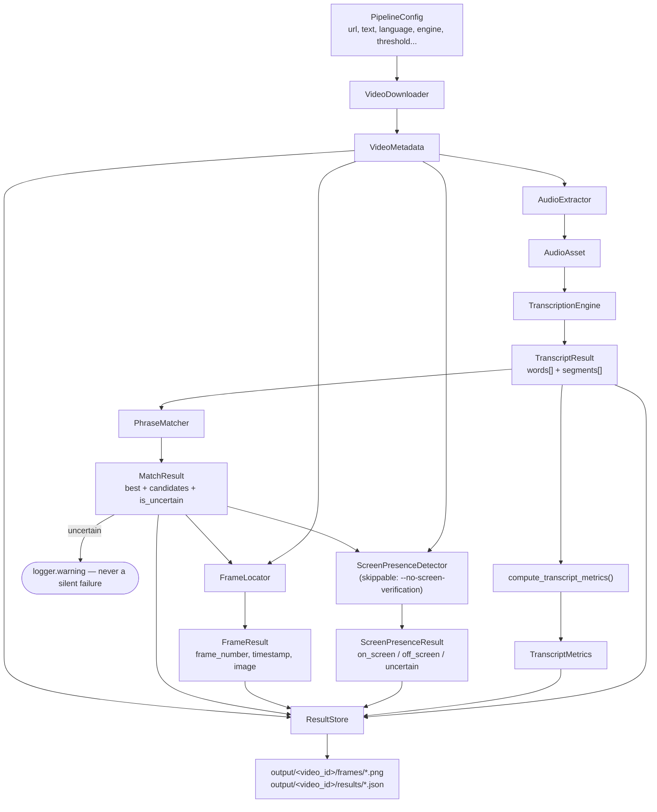

# Approach & Design Document
## Locating the Exact Frame Where a Line of Dialogue Is Spoken

---

## Table of Contents

1. [Problem](#1-problem)
2. [Solution](#2-solution)
3. [Functional Requirements](#3-functional-requirements)
4. [Non-Functional Requirements](#4-non-functional-requirements)
5. [Additional Requirements (Future Scope)](#5-additional-requirements-future-scope)
6. [Scope of This Document](#6-scope-of-this-document)
7. [Approaches Considered](#7-approaches-considered)
8. [Phase-Wise Development Plan & Timeline](#8-phase-wise-development-plan--timeline)
9. [System Architecture](#9-system-architecture)
10. [User Flow](#10-user-flow)
11. [System Flow](#11-system-flow)
12. [Edge Cases and Handling](#12-edge-cases-and-handling)
13. [Assumptions](#13-assumptions)
14. [Customer Impact](#14-customer-impact)
15. [Novelty and USP](#15-novelty-and-usp)
16. [Installation, Setup, and Distribution](#16-installation-setup-and-distribution)
17. [Implementation Notes: What the Plan Didn't Know Yet](#17-implementation-notes-what-the-plan-didnt-know-yet)
18. [References and Links](#18-references-and-links)

---

## 1. Problem

Given a public video URL and a line of dialogue, find the exact frame where
that line is spoken and return its **timestamp**, **frame number**,
**matched text**, and a saved **frame image**. If no target line is given,
find and return every line of dialogue spoken in the video instead.

The dialogue in the assignment's video exists only in the audio track — no
burned-in captions. That rules out OCR as the core mechanism and points
straight at speech-to-text with word-level timestamps.

"On-screen dialogue" has two readings: captioned text burned into the frame
(ruled out above — this video has none), and the speaking character being
*visibly on camera* saying the line, as opposed to voice-over or off-screen
narration. This system answers both — see §7 and §9.

The solution must work on an arbitrary public video without manual
inspection, and must generalize: the evaluator may substitute a different
video or target line entirely, so nothing here is tuned to the one sample
clip and phrase provided (`https://ok.ru/video/248244667877`, *"My mind
rebels at stagnation"*).

---

## 2. Solution

One video is transcribed **once**, then searched as many times as needed.
That single design choice is why the CLI supports both a one-shot search and
an interactive multi-query session off the same pipeline:



- **Single search** — `--url` + `--text` given together: one search, one
  result, then exit. The classic one-shot CLI behavior.
- **Interactive session** — `--url` only: download + transcribe once, then
  repeatedly prompt for a dialogue line and search the already-transcribed
  session for it, looping until exit. Everything right of "session ready" is
  cheap and repeatable — only matching, locating, and verifying re-run per
  query, never the download/transcribe step again.

Both paths write to the same `output/<video_id>/` folder — see
[README.md](README.md#interactive-session-mode) for exact commands and a
sample transcript.

---

## 3. Functional Requirements

- Accept a public video URL as input (`--url`).
- Accept an optional target dialogue string (`--text`); when omitted, start
  an interactive session that accepts one dialogue line at a time.
- For a single search, return: timestamp, frame number, matched text, match
  score, an on-screen verdict, and a saved frame image.
- Show the matched frame — and, when a search is ambiguous, the other
  top-scoring candidates — as an inline color preview in the terminal, not
  just a file path (`--no-images` to opt out).
- Persist every result as JSON + PNG, keyed per video, without overwriting
  an earlier search against the same video.
- Append a plain-text, human-readable record of every search (query,
  timestamp, frame, score, on-screen verdict) to a running per-video log,
  independent of the machine-shaped JSON (`--no-session-log` to opt out).
- Surface every line of dialogue spoken in the video (the full transcript),
  not only the phrase that was searched for.
- Report a clear, structured result — never crash silently — when nothing
  clears the match threshold or on-screen verification is inconclusive.
- Generalize to a different video URL or target phrase without any code
  change.

---

## 4. Non-Functional Requirements

- **Robustness** — never a silent failure; an uncertain result is flagged
  with a specific reason, not guessed at or dropped (§12).
- **Efficiency** — download and transcribe once per video (SQLite cache +
  interactive session); only the cheap match/locate/verify/save steps
  re-run per additional query.
- **Modularity** — SOLID, interface-driven: one abstract interface per
  stage, each with a swappable implementation (WhisperX ↔ Vosk today; the
  on-screen stage is the same kind of swappable seam for a future
  active-speaker-detection provider).
- **Reproducibility** — `uv.lock` pins the full dependency graph; matching
  and on-screen thresholds are deterministic and documented, not tuned per
  video.
- **Self-containment** — no hosted API key, account, or gated model access
  is required anywhere in the pipeline. A deliberate tradeoff against a more
  accurate but externally-dependent alternative — see §7.
- **Testability** — 197 tests, mocked at each external-library boundary,
  running in a few seconds with no network access required.
- **Right-sized scope** — a CLI a single evaluator can run; no job queue,
  web server, or infrastructure beyond what this actually needs.

---

## 5. Additional Requirements (Future Scope)

Deliberately **not implemented** in this submission, listed to show the
design space beyond what was built:

- Scene-cut detection, so a speaking run is never allowed to span a
  detected cut and land on a motion-blurred transition frame.
- OCR + audio cross-confirmation, for a video where captions *are* burned
  in — the two signals corroborating each other rather than either alone.
- Swapping the local on-screen heuristic (§7, §9) for a trained local
  active-speaker-detection model (e.g. Light-ASD) if accuracy matters more
  than the zero-extra-dependency property it currently has.
- Per-language threshold tuning beyond the interpolated-timestamp fallback
  already in place for languages without a dedicated wav2vec2 aligner.
- Multiple target phrases searched in a single request (today: one line at
  a time via the interactive session).

---

## 6. Scope of This Document

This document explains the system's architecture, why each technology was
chosen over the alternatives considered, how ambiguous or uncertain results
are detected and reported rather than guessed at, and what was learned only
by actually running the system against real audio and a real video URL
rather than assumed from documentation (§17). Setup and CLI usage are kept
in [README.md](README.md) rather than duplicated here, so there is exactly
one place that can go stale.

---

## 7. Approaches Considered

### 7.1 Recommended — WhisperX + fuzzy matching + a local on-screen heuristic

**What:** WhisperX (`faster-whisper` + wav2vec2 forced alignment) for
word-level transcription, RapidFuzz sliding-window matching against the
target phrase, OpenCV for frame extraction, and a self-contained OpenCV
Haar-cascade + mouth-motion heuristic to verify the speaker was visibly on
camera.

**Why this:** The dialogue is audio-only, so transcription is the correct
core mechanism (not OCR). WhisperX's forced-alignment pass is what turns
"roughly the right second" into "the exact frame" — sub-100ms word
timestamps versus plain Whisper's ~1s interpolated drift. The on-screen
step answers the literal reading of "on-screen dialogue" without adding any
external dependency the pipeline didn't already need.

**Pros:** No API key or account required anywhere; deterministic and
testable at every stage; transcribing once and searching repeatedly makes
the interactive session cheap; every uncertain result is flagged with a
reason instead of guessed at.

**Cons:** The on-screen heuristic is less accurate than a trained
active-speaker-detection model (§7.2); heavy background noise degrades
word-level alignment; no denoising stage.

### 7.2 Considered, not chosen — hosted active-speaker detection + diarization

**What:** Speaker diarization (`pyannote-audio`) plus a hosted
active-speaker-detection service (e.g. NVIDIA's ASD NIM) to verify, per
candidate window, whether a visible face is producing the matched audio.

**Why considered:** This is the more accurate way to answer "was the
speaker visibly on camera" — a trained model instead of a heuristic, plus
diarization to identify *which* visible face is the one speaking when
several are in frame.

**Why not chosen:** It needs an API key, a Hugging Face token with a gated
model's terms accepted, and live network access to a third party at
evaluation time. Any one of those being unavailable fails the whole stage —
a real risk for a submission that has to run in an environment the author
doesn't control. Rejected in favor of §7.1's self-contained heuristic;
listed in §5 as future scope if accuracy is prioritized over that tradeoff.

### 7.3 Fallback — Vosk instead of WhisperX

**What:** Same pipeline, `Vosk` in place of WhisperX for transcription.

**Why:** Much smaller model, no GPU expectation, useful if the evaluation
machine can't comfortably run WhisperX. Selectable today via `--engine
vosk` — an Open/Closed seam, not a hypothetical.

**Cons:** Word-level timestamps are less precise than forced alignment.

### 7.4 Rejected — OCR on sampled frames

**What:** Scan sampled frames for burned-in caption text instead of
transcribing audio.

**Why rejected:** The assignment's video has no on-screen caption text —
wrong tool for audio-only dialogue. Kept as documented future scope (§5)
for a video where OCR + audio cross-confirmation would actually help.

---

## 8. Phase-Wise Development Plan & Timeline

Built stage by stage so a demonstrable result existed at every step, rather
than integrating everything once at the end.

| Phase | Deliverable | Gate before the next phase started |
|---|---|---|
| 1 — Ingestion | `yt-dlp` download + metadata, SQLite-backed sequenced registry cache | Run against the real assigned URL; metadata (fps, duration, codec) inspected |
| 2 — Matching & frames | RapidFuzz sliding-window matcher, timestamp→frame mapping, OpenCV seek + extract | Full pipeline run against a synthesized speech clip; extracted frame opened and confirmed correct |
| 3 — Robustness | Never-silent uncertainty handling, config knobs, `--language` swap, first real test suite | Uncertain-match and language-swap tests green; own tests caught a real scoring bug (§17) |
| 4 — Packaging | Multi-stage `uv`-based Dockerfile, dependency pinning | WhisperX actually imported and ran, not just passed mocked tests — surfaced the four issues in §17 |
| 5 — UX | Interactive multi-query CLI session (`prepare()`/`locate_dialogue()`/`cleanup()` split) | Driven manually end to end: multiple searches against one cached session, then exit |
| 6 — On-screen verification | Stage 6, local heuristic, `--no-screen-verification` | Ran for real against a synthesized clip and a real bug-hunting smoke test (§17) |

197 tests passing (`pytest`); see [README.md](README.md#5-run-the-tests) for
how to run them.

---

## 9. System Architecture

| # | Stage | Tool | Input → Output | Module |
|---|---|---|---|---|
| 1 | Ingestion | `yt-dlp` (+ SQLite cache) | URL → local video file + metadata | `ingestion/ytdlp_downloader.py` |
| 2 | Audio extraction | `ffmpeg` | video → mono 16kHz WAV | `audio/ffmpeg_extractor.py` |
| 3 | Transcription | WhisperX (or Vosk) | WAV → word-level transcript | `transcription/whisperx_engine.py` |
| 4 | Phrase matching | RapidFuzz, sliding window | transcript + target text → best span | `matching/fuzzy_matcher.py` |
| 5 | Frame location | OpenCV seek | `start_time × fps` → frame image | `frame_locator/opencv_locator.py` |
| 6 | On-screen verification | OpenCV Haar cascade (local heuristic) | matched window → on/off/uncertain verdict | `screen_presence/opencv_detector.py` |
| 7 | Reporting | stdlib `json` + `cv2.imwrite` | all of the above → `result.json` + `.png` | `output/json_store.py` |

```
src/
├── main.py            # composition root — only file wiring concretes → interfaces
├── pipeline.py         # orchestrates stages 1-7 via interfaces only
├── config.py            # PipelineConfig + CLI parsing
├── ingestion/           # VideoDownloader(ABC) → YtDlpDownloader + VideoRegistry (SQLite cache)
├── audio/                # AudioExtractor(ABC) → FfmpegAudioExtractor
├── transcription/         # TranscriptionEngine(ABC) → WhisperXEngine | VoskEngine
├── matching/               # PhraseMatcher(ABC) → FuzzyMatcher
├── frame_locator/           # FrameLocator(ABC) → OpenCvFrameLocator
├── screen_presence/          # ScreenPresenceDetector(ABC) → OpenCvScreenPresenceDetector
├── metrics/                    # transcript word/confidence metrics
└── output/                      # ResultStore(ABC) → JsonResultStore
```

| Principle | Where |
|---|---|
| **S**ingle Responsibility | one module = one stage; `pipeline.py` only orchestrates |
| **O**pen/Closed | new engine (e.g. `insanely-fast-whisper`) = new file, zero edits elsewhere |
| **L**iskov Substitution | any `TranscriptionEngine`/`PhraseMatcher`/`ScreenPresenceDetector`/... is a drop-in swap |
| **I**nterface Segregation | each `ABC` exposes exactly one method (`download`, `extract`, `match`, `verify`, ...) |
| **D**ependency Inversion | `DialoguePipeline.__init__` takes interfaces; only `main.py` imports concretes |

---

## 10. User Flow



A single search and the interactive session are the same underlying calls
(`prepare()` once, `locate_dialogue()` per query) — the only difference is
whether `main.py` calls `locate_dialogue()` once or loops on stdin. See
[README's Interactive session mode](README.md#interactive-session-mode) for
a real captured transcript of this flow.

---

## 11. System Flow



**Objects that flow through the pipeline** (real frozen `dataclass`es —
exact fields in each `src/*/base.py`):

| Object | Key fields |
|---|---|
| `VideoMetadata` | `video_id, file_path, fps, duration_seconds, width, height, sequence_id` |
| `AudioAsset` | `file_path, sample_rate_hz=16000, channels=1, duration_seconds` |
| `Word` | `text, start_seconds, end_seconds, confidence` — what the matcher searches |
| `DialogueSegment` | `text, start_seconds, end_seconds, confidence` — one spoken utterance |
| `TranscriptResult` | `words: tuple[Word]`, `segments: tuple[DialogueSegment]`, `language`, `engine_name` |
| `TranscriptMetrics` | `total_words, unique_words, word_frequencies, avg/min/max confidence, words_per_minute` |
| `MatchCandidate` | `matched_text, start_seconds, end_seconds, score (0-100), word_start/end_index` |
| `MatchResult` | `best: MatchCandidate \| None (never None), candidates[], is_uncertain, uncertainty_reason` |
| `FrameResult` | `frame_number, timestamp ("HH:MM:SS.sss"), image: np.ndarray (BGR)` |
| `ScreenPresenceResult` | `status ("on_screen"\|"off_screen"\|"uncertain"), confidence, reason, face_ratio, mouth_motion_score, frames_sampled` |

**What actually lands on disk** — `output/<video_id>/results/result_<frame>.json`
(trimmed; full shape in `output/json_store.py::_build_payload`):

```jsonc
{
  "video": { "video_id": "...", "title": "...", "fps": 25.0, "...": "..." },
  "query": { "target_text": "My mind rebels at stagnation" },
  "result": {
    "timestamp": "00:00:42.360",
    "frame_number": 1059,
    "matched_text": "My mind rebels at stagnation",
    "match_score": 96.5,
    "is_uncertain": false,
    "frame_image_path": "output/<id>/frames/frame_1059.png",
    "screen_presence": {
      "status": "on_screen",
      "confidence": 0.87,
      "reason": "a face was visible in 100% of sampled frames with mouth movement consistent with speech",
      "face_ratio": 1.0,
      "mouth_motion_score": 0.061,
      "frames_sampled": 8
    }
  },
  "candidates": [ /* every span that cleared the threshold */ ],
  "transcript_metrics": { "total_words": 812, "words_per_minute": 142.3, "...": "..." },
  "transcript": [
    /* every DialogueSegment ever spoken — not just the matched phrase */
    { "text": "My mind rebels at stagnation.", "start_seconds": 42.36, "confidence": 0.87 }
  ]
}
```

---

## 12. Edge Cases and Handling

| Case | Handling |
|---|---|
| No transcript span clears the match threshold | Best-scoring span still returned, flagged `is_uncertain: true` with a reason |
| Match found but ASR confidence on those words is low | Still returned, but flagged — a lucky low-confidence match is more likely noise than a wrong-frame bug |
| Dialogue repeated in the video | First occurrence wins by default (matches "first appears"); every candidate above threshold logged for review |
| ASR mishears a word in the target phrase | RapidFuzz fuzzy match tolerates it; a width-preference margin stops a truncated window from outscoring the correct one (§17) |
| Speaker's face not detected in enough sampled frames | `status: "off_screen"`, with `face_ratio` in the reason, never silently upgraded |
| Face detected but not moving (static shot / silent listener) | `status: "uncertain"` — distinguishes "no face" from "a face was there but not clearly speaking" |
| Video seek lands a few frames off on some codecs | `OpenCvFrameLocator` falls back to sequential reads from a safe checkpoint |
| AV1-encoded download | Format selector prefers `avc1`/h264 — OpenCV's bundled decoder seeks AV1 unreliably |
| No muxed progressive stream (most modern YouTube videos) | Format selector merges separate video+audio streams via `ffmpeg` |
| Repeat run against the same URL | SQLite `VideoRegistry` cache hit — skips the download entirely |
| Language has no dedicated wav2vec2 aligner | Falls back to interpolated (less precise) word timestamps, logged as a warning, not hidden |
| A single pipeline stage fails outright | Raises its own typed exception (`DownloadError`, `TranscriptionError`, ...); `main.py` maps it to a clean exit code, never a raw traceback |
| A search fails mid-interactive-session | Logged, loop keeps prompting — one bad search doesn't end the session |

---

## 13. Assumptions

| Assumption | Reasoning |
|---|---|
| The target dialogue exists only in the audio track, not as a burned-in caption | Confirmed for the assignment's video; OCR is out of scope as a result (§5, §7.4) |
| A single public video URL is processed per request | Scope boundary — no playlist/live-stream handling |
| Only the primary/default audio track is used | No multi-dub-track selection in this submission |
| English is the default working language | `--language` is swappable and demonstrably reaches the transcriber untouched by pipeline code; not threshold-tuned per language |
| The on-screen heuristic's thresholds are reasonable defaults | Not empirically calibrated against a labeled dataset (§17) — documented as a heuristic, not a trained model's calibrated output |
| `frame_number = round(start_time × fps)` is accurate enough | Uses the video's own probed fps; `OpenCvFrameLocator`'s drift-tolerant fallback handles the cases where direct seeking isn't frame-exact |
| No model in the pipeline is trained from scratch | Every component (WhisperX, Vosk, RapidFuzz, OpenCV's Haar cascade) is pretrained/off-the-shelf |
| The pipeline should work without any external account, API key, or gated model access | Deliberate — Silero VAD chosen over pyannote's default, and a local heuristic over a hosted ASD service, specifically for this (§7.2) |

---

## 14. Customer Impact

Converts an unstructured video into a searchable answer to "where was this
line spoken, and was the speaker visibly on camera saying it" — not
validated with real users, and intentionally scoped honestly rather than
priced (see [README's Potential Applications](README.md#potential-applications)
for the full, hedged list):

- **Video editing / clip creation** — jump straight to the frame a quoted
  line was said, instead of scrubbing a timeline by hand.
- **Content research** — locate a specific quote inside a long recording
  (interview, lecture, podcast video) without watching it end to end.
- **QA / verification** — confirm a line was actually spoken, and exactly
  when, against a transcript or subtitle claim.

---

## 15. Novelty and USP

| Existing approach | Limitation |
|---|---|
| Manual scrubbing through the video | Exactly what this tool exists to avoid |
| Caption/subtitle search | Finds where *text* occurs — no on-screen/off-screen concept, and this video has no captions to search in the first place |
| Plain Whisper / faster-whisper alone | Segment-level timestamps only; word timestamps interpolated, drift up to ~1s — can miss a fast cut |
| A hosted active-speaker-detection service (§7.2) | More accurate on-screen verification, but depends on an API key, a gated model token, and live third-party network access at evaluation time |

What this project does differently:

- Transcribes once, searches many times — the interactive session amortizes
  the expensive stages across every dialogue line checked, not just the one
  in the sample request.
- Surfaces the full spoken transcript alongside the matched phrase, not
  just the one match (`"transcript"` in every result JSON).
- Answers the literal "on-screen" reading (§1, §7) with zero external
  dependencies, trading some accuracy for something that can't fail because
  a third-party service is unreachable at evaluation time.
- Every uncertain result is flagged with a specific, documented reason —
  never a bare true/false, and never a silently wrong confident answer.

---

## 16. Installation, Setup, and Distribution

Full, current setup instructions — Docker and native `uv` paths, every CLI
flag, and how to run the test suite — are kept in
[README.md](README.md) rather than duplicated here, so there is exactly one
place that can go stale. What doesn't change run to run: results (JSON +
frame images) are written to `output/`; no API key, account, or gated model
access is required anywhere in the pipeline (§4, §7.2); and a multi-stage
Dockerfile is provided so the evaluator doesn't need Python, `ffmpeg`, or
the ML dependency stack installed locally to reproduce the environment this
was built against.

---

## 17. Implementation Notes: What the Plan Didn't Know Yet

`whisperx` alone under-specifies a runnable environment. Four real,
unmocked failures surfaced while getting the first real transcription to
run — none catchable by `uv`'s resolver alone (runtime API/ABI breaks, not
version conflicts):

| Symptom | Cause | Fix |
|---|---|---|
| `OSError: libcudart.so.13` | `torch` pinned to CPU wheel index, `torchaudio` resolved from the default CUDA index | Pin `torchaudio` to the same CPU index (`[tool.uv.sources]`) |
| `RuntimeError: torchvision::nms does not exist` | Same CPU/CUDA mismatch, via `transformers`' `torchvision` import | Pin `torchvision` to the CPU index too |
| `AttributeError: torchaudio.AudioMetaData` | `pyannote-audio` (WhisperX dep) calls a `torchaudio` API removed upstream | Force `pyannote-audio>=4.0` + `whisperx>=3.8.4` + `numpy>=2.1.0` |
| `OSError: cannot enable executable stack` | `ctranslate2`'s shared lib has an executable `GNU_STACK` flag; rejected by hardened kernels | `patchelf --clear-execstack` on the `.so`, baked into the Dockerfile |

Also found by running the real system, not written down as gaps in advance:

- **yt-dlp `Requested format is not available`.** The default selector
  wants a single progressive stream; most modern YouTube videos serve
  separate video/audio DASH streams instead. Fixed with
  `bestvideo*[vcodec^=avc1]+bestaudio/...` + `merge_output_format: mp4`.
- **OpenCV garbage frame seeks.** The video the fixed selector picked was
  AV1-encoded, and OpenCV's bundled decoder couldn't seek it reliably.
  Added an `avc1`/h264 preference to the same format selector.
- **`token_sort_ratio` length sensitivity.** A truncated matcher window
  occasionally scored a couple of points higher than the genuinely correct
  full-width one, purely from string-length sensitivity. Caught by the
  matcher's own test suite before it ever ran against real audio; fixed
  with a margin-based width preference (`WIDTH_PREFERENCE_MARGIN`) so the
  matcher only switches window width when a competing width wins by enough
  to represent a real insertion/deletion, not scoring noise.
- **Silero VAD over pyannote's default.** WhisperX's default VAD backend
  needs a Hugging Face account and auth token for a gated model — chosen
  against, since it conflicts with "should work without manual
  intervention." Silero downloads publicly via `torch.hub`.

### Verified end-to-end (real, not mocked)

Every stage runs for real (`ffmpeg`, `WhisperXEngine`, `FuzzyMatcher`,
`OpenCvFrameLocator`, `OpenCvScreenPresenceDetector`, `JsonResultStore`)
against a synthesized speech clip (`espeak-ng` → "My mind rebels at
stagnation" → muxed into a black-frame video with `ffmpeg`):

```
Timestamp : 00:00:00.034   Frame : 0   Score : 98.2   Uncertain : False
Text      : "my mind rebels at stagnation."
OnScreen  : OFF_SCREEN (confidence 1.0, face_ratio 0.0)
```

`OFF_SCREEN` is the correct call, not a limitation showing through — the
synthesized clip is a plain black frame with no face in it, so the
heuristic correctly reports no visible speaker rather than a false
`on_screen`. A weaker model (`tiny` vs. `small`) on the same clip correctly
produced a low score + `is_uncertain: true` — §12's handling doing its job
on a genuinely bad transcription rather than hiding it. A later run against
a real YouTube URL caught the yt-dlp/OpenCV issues above — exactly the
class of bug a mock can't surface.

---

## 18. References and Links

- yt-dlp: https://github.com/yt-dlp/yt-dlp
- ffmpeg: https://ffmpeg.org/
- WhisperX: https://github.com/m-bain/whisperX
- faster-whisper: https://github.com/SYSTRAN/faster-whisper
- Vosk: https://alphacephei.com/vosk/
- RapidFuzz: https://github.com/rapidfuzz/RapidFuzz
- OpenCV: https://opencv.org/
- Silero VAD: https://github.com/snakers4/silero-vad
- uv: https://docs.astral.sh/uv/
