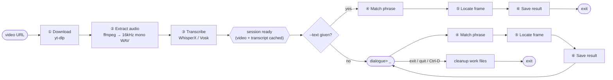
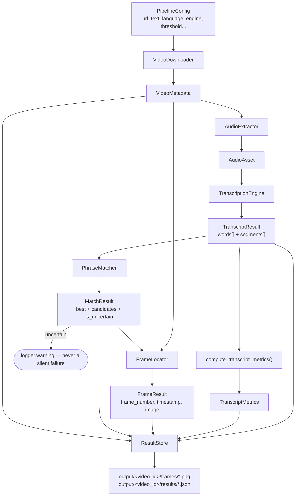

# Approach: Locating a Dialogue's Frame in a Video

## 1. The problem, in one line

Given a **video URL** + a **line of dialogue**, return the exact 
 - **timestamp**, 
 - **frame number**,
 - **matched text**, and a saved 
 - **frame image**.

> **Key constraint:** the dialogue only exists in the audio track no burned-in captions.  
> That rules out OCR as the core mechanism and points straight at **speech-to-text with word-level timestamps**: 
> transcribe the audio → find the phrase in the transcript → convert its timestamp to aframe number.

---
## 2. Approach at a glance

One video is transcribed **once**, then searched as many times as needed. That single design choice is why the CLI supports both a one-shot search and an interactive multi-query session:



- **Right of it** is cheap and repeatable: each dialogue line only re-runs matching + frame-seeking, never the download/transcribe step again.
- Passing `--text` on the command line skips the prompt and behaves like a classic one-shot 
- CLI tool; omitting it starts the interactive loop. Both paths write to the same `output/<video_id>/` folder — see [README.md](README.md#interactive-session-mode) for exact commands and a sample transcript.

---
## 3. Pipeline stages

| #   | Stage            | Tool                          | Input → Output                            | Module                             |
| --- | ---------------- | ----------------------------- | ----------------------------------------- | ---------------------------------- |
| 1   | Ingestion        | `yt-dlp` (+ SQLite cache)     | URL → local video file + metadata         | `ingestion/ytdlp_downloader.py`    |
| 2   | Audio extraction | `ffmpeg`                      | video → mono 16kHz WAV                    | `audio/ffmpeg_extractor.py`        |
| 3   | Transcription    | WhisperX (or Vosk)            | WAV → word-level transcript               | `transcription/whisperx_engine.py` |
| 4   | Phrase matching  | RapidFuzz, sliding window     | transcript + target text → best span      | `matching/fuzzy_matcher.py`        |
| 5   | Frame location   | OpenCV seek                   | `start_time × fps` → frame image          | `frame_locator/opencv_locator.py`  |
| 6   | Reporting        | stdlib `json` + `cv2.imwrite` | all of the above → `result.json` + `.png` | `output/json_store.py`             |

Every stage is one class behind one `ABC` interface (`base.py` in each
package). `pipeline.py` only calls those interfaces — it never imports a
concrete class. `main.py` is the single place that wires interfaces to
implementations (the composition root).

---

## 4. Data flow & schema



**Objects that flow through the pipeline** (real frozen `dataclass`es —
exact fields in each `src/*/base.py`):

| Object              | Key fields                                                                                  |
| ------------------- | ------------------------------------------------------------------------------------------- |
| `VideoMetadata`     | `video_id, file_path, fps, duration_seconds, width, height, sequence_id`                    |
| `AudioAsset`        | `file_path, sample_rate_hz=16000, channels=1, duration_seconds`                             |
| `Word`              | `text, start_seconds, end_seconds, confidence`  what the matcher searches                   |
| `DialogueSegment`   | `text, start_seconds, end_seconds, confidence`  one spoken utterance                        |
| `TranscriptResult`  | `words: tuple[Word]`, `segments: tuple[DialogueSegment]`, `language`, `engine_name`         |
| `TranscriptMetrics` | `total_words, unique_words, word_frequencies, avg/min/max confidence, words_per_minute`     |
| `MatchCandidate`    | `matched_text, start_seconds, end_seconds, score (0-100), word_start/end_index`             |
| `MatchResult`       | `best: MatchCandidate \| None (never None), candidates[], is_uncertain, uncertainty_reason` |
| `FrameResult`       | `frame_number, timestamp ("HH:MM:SS.sss"), image: np.ndarray (BGR)`                         |

**What actually lands on disk** — `output/<video_id>/results/result_<frame>.json`
(trimmed; full shape in `output/json_store.py::_build_payload`):

```jsonc
{
  "video": { "video_id": "...", "title": "...", "fps": 25.0, "...": "..." },
  "query": { "target_text": "My mind rebels at stagnation" },
  "result": {
    "timestamp": "00:00:42.360", 
    "frame_number": 1059,
    "matched_text": "My mind rebels at stagnation", 
    "match_score": 96.5,
    "is_uncertain": false, 
    "frame_image_path": "output/<id>/frames/frame_1059.png"
  },
  "candidates": [ /* every span that cleared the threshold */ ],
  "transcript_metrics": {
                          "total_words": 812,
                          "words_per_minute": 142.3,
                          "...": "..."
                        },
  "transcript": [
    /* every DialogueSegment ever spoken — not just the matched phrase */
    { "text": "My mind rebels at stagnation.", "start_seconds": 42.36, "confidence": 0.87 }
  ]
}
```

---

## 5. Why audio + WhisperX (and what was rejected)

| Approach                                                  | Precision                                                   | Speed                     | Verdict                                                                                       |
| --------------------------------------------------------- | ----------------------------------------------------------- | ------------------------- | --------------------------------------------------------------------------------------------- |
| OCR on sampled frames                                     | no on-screen text in this video                             | Wasted scanning           | **Rejected**  wrong tool for audio-only dialogue                                              |
| Whisper / faster-whisper alone                            | Segment-level only; word timestamps interpolated, drift ~1s | Fast                      | Drift can miss a fast cut not precise enough                                                  |
| **WhisperX** (faster-whisper + wav2vec2 forced alignment) | **Sub-100ms word timestamps**                               | Fast, CPU-usable          | **Chosen** this precision is the gap between "roughly the right second" and "the exact frame" |
| Vosk                                                      | Word-level, less precise than forced alignment              | Very fast, tiny footprint | Lightweight fallback (`--engine vosk`)                                                        |

**Bonus of transcribing once:** if evaluators swap in a different dialogue line for the same video, only the cheap match/locate/save steps re-run this is exactly what the interactive session exploits.

**Future scope, not built for the deadline:** scene-cut detection to avoid landing on a motion-blurred transition frame; OCR + audio cross-confirmation for videos where captions *are* burned in, to raise confidence when both
signals agree.

---

## 6. Source structure (SOLID)

```
src/
├── main.py            # composition root — only file wiring concretes → interfaces
├── pipeline.py         # orchestrates stages 1-6 via interfaces only
├── config.py            # PipelineConfig + CLI parsing
├── ingestion/           # VideoDownloader(ABC) → YtDlpDownloader + VideoRegistry (SQLite cache)
├── audio/                # AudioExtractor(ABC) → FfmpegAudioExtractor
├── transcription/         # TranscriptionEngine(ABC) → WhisperXEngine | VoskEngine
├── matching/               # PhraseMatcher(ABC) → FuzzyMatcher
├── frame_locator/           # FrameLocator(ABC) → OpenCvFrameLocator
├── metrics/                  # transcript word/confidence metrics
└── output/                    # ResultStore(ABC) → JsonResultStore
```

| Principle | Where |
|---|---|
| **S**ingle Responsibility | one module = one stage; `pipeline.py` only orchestrates |
| **O**pen/Closed | new engine (e.g. `insanely-fast-whisper`) = new file, zero edits elsewhere |
| **L**iskov Substitution | any `TranscriptionEngine`/`PhraseMatcher`/... is a drop-in swap |
| **I**nterface Segregation | each `ABC` exposes exactly one method (`download`, `extract`, `match`, ...) |
| **D**ependency Inversion | `DialoguePipeline.__init__` takes interfaces; only `main.py` imports concretes |

---

## 7. Uncertainty handling — never a silent failure

- **Nothing clears the match threshold** → best-scoring span is still
  returned, flagged `is_uncertain: true` with a reason (e.g. *"best match
  scored 42.0, below threshold 80.0"*).
- **Match found but ASR confidence is low** → still returned, but flagged —
  a lucky low-confidence match is more likely noise than a wrong-frame bug.
- **Dialogue repeated in the video** → first occurrence wins by default
  (matches "first appears" in the problem statement); every candidate above
  threshold is still logged for manual review.

---

## 8. Known limitations

- Heavy background music/noise degrades word alignment; no denoising stage.
- Forced alignment is per-language; languages without a wav2vec2 aligner
  fall back to interpolated (less precise) timestamps a documented
  degradation, not a silent one (`WhisperXEngine._interpolate_words`).
- No visual verification pass (e.g. rejecting a mid-blink frame)
---

## 9. Engineering notes: getting WhisperX to actually run

`whisperx` alone under-specifies a runnable environment. Four real,
unmocked failures surfaced while getting the first real transcription to
run none catchable by `uv`'s resolver alone (runtime API/ABI breaks, not
version conflicts):

| Symptom                                         | Cause                                                                                          | Fix                                                                            |
| ----------------------------------------------- | ---------------------------------------------------------------------------------------------- | ------------------------------------------------------------------------------ |
| `OSError: libcudart.so.13`                      | `torch` pinned to CPU wheel index, `torchaudio` resolved from the default CUDA index           | Pin `torchaudio` to the same CPU index (`[tool.uv.sources]`)                   |
| `RuntimeError: torchvision::nms does not exist` | Same CPU/CUDA mismatch, via `transformers`' `torchvision` import                               | Pin `torchvision` to the CPU index too                                         |
| `AttributeError: torchaudio.AudioMetaData`      | `pyannote-audio` (WhisperX dep) calls a `torchaudio` API removed upstream                      | Force `pyannote-audio>=4.0` + `whisperx>=3.8.4` + `numpy>=2.1.0`               |
| `OSError: cannot enable executable stack`       | `ctranslate2`'s shared lib has an executable `GNU_STACK` flag; rejected by hardened kernels    | `patchelf --clear-execstack` on the `.so`, baked into the Dockerfile           |
| yt-dlp `Requested format is not available`      | Default selector wants one progressive stream; most YouTube videos serve separate DASH streams | `bestvideo*[vcodec^=avc1]+bestaudio/...` selector + `merge_output_format: mp4` |
| OpenCV garbage frame seeks                      | AV1 decoding unreliable in OpenCV's bundled ffmpeg                                             | Prefer `avc1`/h264 in the same format selector                                 |

Also: **Silero VAD** was chosen over WhisperX's default **pyannote** VAD —
pyannote needs a gated HuggingFace model + auth token, which conflicts with
"should work without manual intervention." Silero downloads publicly via
`torch.hub`.

### Verified end-to-end (real, not mocked)

Stages 2-6 run for real (`ffmpeg`, `WhisperXEngine`, `FuzzyMatcher`,
`OpenCvFrameLocator`, `JsonResultStore`) against a synthesized speech clip
(`espeak-ng` → "My mind rebels at stagnation" → muxed video):

```
Timestamp : 00:00:00.054   Frame : 1   Score : 98.2   Uncertain : False
Text      : "My mind rebels at stagnation."
```

A weaker model (`tiny` vs. `small`) on the same clip correctly produced a low score + `is_uncertain: true` — §7's handling doing its job on a genuinely bad transcription rather than hiding it. 
A later run against a real YouTube URL also caught the yt-dlp/OpenCV issues in the table above exactly the class of bug a mock can't surface.

---

## 10. Sprint status

| Sprint                | Focus                                                              | Status |
| --------------------- | ------------------------------------------------------------------ | ------ |
| 1 — Ingestion         | Download + metadata + registry cache + first real WhisperX run     | [X] D  |
| 2 — Matching & frames | Fuzzy matcher, timestamp→frame mapping, OpenCV seek, first CLI run | [x] D  |
| 3 — Robustness        | Uncertainty handling, config knobs, `--language` swap, test suite  | [x] D  |
| 4 — Packaging         | Dockerfile, dependency pinning , docs finalized                    | [x] D  |
| 5 — UX                | Interactive multi-query session, full re-test                      | [x] D  |

143 tests passing (`pytest`); see [README.md](README.md#5-run-the-tests) for
how to run them.