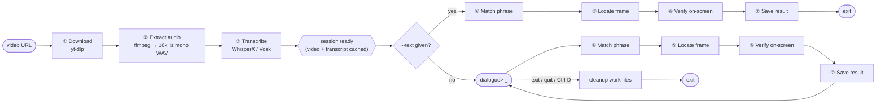

# video-dialogue-finder

Given a video URL and a target line of spoken dialogue, this program finds the
exact video frame where that line is spoken and reports its timestamp, frame
number, matched text, a saved image of that frame, and whether the speaker
was actually visible on camera saying it. If no target line is given, it
starts an interactive session instead: transcribe the video once, then search
it for as many lines as you want, one after another.

This was built for a technical assignment requiring exactly this — work
against an arbitrary public video URL without manual inspection, and
generalize to a different video or target line at evaluation time.

## Contents

- [Overview](#overview)
- [Demo](#demo)
- [Key Features](#key-features)
- [How It Works](#how-it-works)
- [Tech stack](#tech-stack)
- [Project structure](#project-structure)
- [Prerequisites](#prerequisites)
- [Option A — Docker (recommended)](#option-a-docker-recommended)
- [Option B — Native, with uv](#option-b-native-with-uv)
- [CLI reference](#cli-reference)
- [Interactive session mode](#interactive-session-mode)
- [Terminal previews](#terminal-previews)
- [Output layout](#output-layout)
- [End-to-end verification](#end-to-end-verification)
- [Potential Applications](#potential-applications)
- [Documentation](#documentation)
- [Known Limitations and Future Scope](#known-limitations-and-future-scope)
- [Troubleshooting](#troubleshooting)
- [Author](#author)
- [Acknowledgments](#acknowledgments)

---

## Overview

The dialogue in the target video isn't captioned or burned into the frame —
it only exists in the audio track. That rules out OCR as the core mechanism
and points straight at speech-to-text with word-level timestamps: transcribe
the audio, find the phrase in the transcript, convert its timestamp to a
frame number.

One video is transcribed once and can then be searched as many times as
needed — that single design choice is why the CLI supports two modes off the
same pipeline:

- **Single search** — `--url` + `--text` given together: one search, one
  result, then exit. The classic one-shot CLI behavior.
- **Interactive session** — `--url` only: the video is downloaded and
  transcribed exactly once, then the CLI repeatedly prompts for a dialogue
  line, searches the already-transcribed session for it, and loops until you
  exit. See [Interactive session mode](#interactive-session-mode).

"On-screen dialogue" has two readings: captioned text burned into the frame
(ruled out — this project targets audio-only dialogue with no captions), and
the speaking character being visibly on camera, as opposed to voice-over or
off-screen narration. The pipeline answers the second reading too — stage 6
verifies it with a self-contained OpenCV heuristic (face detection + mouth
motion), no external API or hosted model required. See
[approach.md](approach.md) for the full reasoning.

## Demo

**[Demo recording — Google Drive](https://drive.google.com/drive/folders/1JkGIC9JCMdgSLA2FZm255Zz7wxDQabgs?usp=drive_link)**

A recorded run of the CLI against a real video URL, producing a timestamp,
frame number, and saved frame image.

### Example

```
Timestamp : 00:00:42.360
Frame     : 1059
Text      : "My mind rebels at stagnation"
Score     : 96.5
Image     : output/248244667877/frames/frame_1059.png
JSON      : output/248244667877/results/result_1059.json
```

## Key Features

- Word-level dialogue localization via WhisperX (faster-whisper + wav2vec2
  forced alignment) — sub-100ms word timestamps, not just segment-level ones
- Fuzzy phrase matching (RapidFuzz) tolerant of ASR transcription noise, with
  a documented, never-silent uncertainty contract: a low-confidence match is
  still returned, flagged, and explained rather than dropped
- SQLite-backed video registry — a repeat run against the same URL skips the
  download entirely and reuses the cached file
- An interactive multi-query session — transcribe a video once, then search
  it for as many dialogue lines as you want, no re-downloading or
  re-transcribing per line
- A full transcript of every line spoken in the video (not just the matched
  phrase) persisted alongside each result, with word-count/confidence metrics
- A pluggable transcription engine (WhisperX by default, Vosk as a
  lightweight fallback) behind one interface, swappable with a single CLI flag
- On-screen speaker verification (stage 6) — answers the more literal
  "on-screen dialogue" question: was the speaker visibly on camera saying
  the line, not just present somewhere in the audio. A self-contained
  OpenCV face-detection + mouth-motion heuristic, no API key or hosted
  service required (skippable with `--no-screen-verification`)
- Inline terminal frame previews — the matched frame (and, when a search is
  ambiguous, the other top candidates) rendered directly in the terminal in
  color, no image viewer or special terminal required (see
  [Terminal previews](#terminal-previews))
- SOLID, interface-driven architecture — every stage is one class behind one
  abstract interface, wired together in a single composition root
- Dockerized, `uv`-managed dependency pinning (CPU-only torch wheels,
  reproducible lockfile) for a build that doesn't drift between machines
- 197 tests, mocked at each library boundary, running in a few seconds with
  no network access required

## How It Works



The full architecture, the data schema passed between stages, and the
reasoning behind each design decision — including the OCR and plain-Whisper
alternatives considered and why they were rejected — are documented in
[approach.md](approach.md).

---

## Tech stack

| Concern | Tool |
|---|---|
| Language | Python 3.11 / 3.12 |
| Package & environment manager | [uv](https://docs.astral.sh/uv/) (`pyproject.toml` + `uv.lock`) |
| Video download | [yt-dlp](https://github.com/yt-dlp/yt-dlp) |
| Audio extraction | [ffmpeg](https://ffmpeg.org/) (system binary, called via subprocess) |
| Speech-to-text + word alignment | [WhisperX](https://github.com/m-bain/whisperX) (faster-whisper + wav2vec2 forced alignment), CPU by default |
| Fallback ASR engine | [Vosk](https://alphacephei.com/vosk/) |
| Fuzzy phrase matching | [RapidFuzz](https://github.com/rapidfuzz/RapidFuzz) |
| Frame extraction | [OpenCV](https://opencv.org/) (`opencv-python-headless`) |
| On-screen verification | OpenCV Haar cascade face detection + mouth-motion heuristic (self-contained, no API key) |
| Output | JSON (`stdlib json`) + PNG frame image |
| Testing | pytest, pytest-cov |
| Linting | ruff |
| Containerization | Docker (multi-stage, `uv`-based build), Docker Compose |

---

## Project structure

```
.
├── Dockerfile              # multi-stage, uv-based build
├── docker-compose.yml
├── pyproject.toml          # dependencies (uv)
├── uv.lock                 # pinned, reproducible dependency graph
├── .env.example
├── approach.md
├── prompt.txt
├── src/
│   ├── main.py              # CLI entrypoint / composition root
│   ├── pipeline.py           # orchestrates all stages via interfaces only
│   ├── config.py
│   ├── ingestion/            # stage 1: yt-dlp download
│   ├── audio/                # stage 2: ffmpeg extraction
│   ├── transcription/        # stage 3: WhisperX / Vosk
│   ├── matching/              # stage 4: RapidFuzz sliding-window match
│   ├── frame_locator/         # stage 5: OpenCV seek + extract
│   ├── screen_presence/        # stage 6: on-screen speaker verification
│   ├── metrics/                  # transcript word/confidence metrics
│   └── output/                    # stage 7: JSON + image persistence
├── tests/
├── work/                     # scratch: downloaded video/audio (gitignored)
└── output/                   # result.json + frame images (gitignored)
```

Each stage lives behind an ABC in its `base.py`, and `main.py` is the only
file that wires concrete implementations together — see `approach.md` §5 for
the SOLID reasoning.

---

## Prerequisites

Pick **one** of the two setup paths below — Docker (recommended, no local
Python/ffmpeg/CUDA setup needed) or native with `uv`.

| | Docker path | Native `uv` path |
|---|---|---|
| Requires | Docker Engine 24+, Docker Compose v2 | Python 3.11/3.12, [`uv`](https://docs.astral.sh/uv/getting-started/installation/), `ffmpeg` on PATH |
| Isolation | Full (container) | Local `.venv` (uv-managed) |
| Best for | Reproducible run, submission/grading | Local development, debugging, iterating on the matcher |

---

## Option A — Docker (recommended)

### 1. Build the image

```bash
docker compose build
```

This is a multi-stage build: dependencies are resolved and installed with
`uv sync --frozen` from the committed `uv.lock` (so the image build is
reproducible — no dependency drift between your machine and the grader's),
then only the resulting virtual environment + source are copied into a slim
runtime layer alongside the `ffmpeg` system package. The container runs as a
non-root user.

> **Image size note:** `torch` is pinned to the CPU-only wheel index in
> `pyproject.toml` (`[tool.uv.sources]` / `[[tool.uv.index]]`). Without that
> pin, the default PyPI `torch` wheel bundles the full CUDA runtime and adds
> several GB for nothing on a CPU-only container. If you want GPU inference
> inside Docker, see [GPU support](#gpu-support-optional) below.

### 2. Run it

```bash
mkdir -p work output   # first run only; compose bind-mounts these

docker compose run --rm dialogue-finder \
  --url "https://ok.ru/video/248244667877" \
  --text "My mind rebels at stagnation"
```

- `./work` and `./output` are bind-mounted into the container (see
  `docker-compose.yml`), so downloaded video/audio and the final
  JSON+image results land on your host, not just inside the container.
- Every CLI flag documented in [CLI reference](#cli-reference) works the
  same way after `dialogue-finder`.
- `docker compose run --rm dialogue-finder --help` prints usage without
  running anything.
- Omit `--text` to drop into an [interactive session](#interactive-session-mode)
  instead — Docker's `run` is interactive by default, so the `dialogue>`
  prompt works the same as running natively.

### 3. Tear down

```bash
docker compose down
```

(There's no long-running service to stop — `run` executes one pipeline pass
and exits — this just removes the created container/network if any remain.)

### GPU support (optional)

The default image and `pyproject.toml` target CPU inference (`--device cpu`,
the default). To use a GPU:

1. Install the [NVIDIA Container Toolkit](https://docs.nvidia.com/datacenter/cloud-native/container-toolkit/latest/install-guide.html) on the host.
2. Replace the CPU torch pin in `pyproject.toml` with a CUDA build (or build
   a separate `Dockerfile.gpu` from a `nvidia/cuda` base image).
3. Add a `deploy.resources.reservations.devices` GPU reservation to the
   compose service, and pass `--device cuda` to the CLI.

Not included by default to keep the base image lean and CPU-portable, as
called out in `approach.md`.

---

## Option B — Native, with `uv`

### 1. Install prerequisites

- Python 3.11 or 3.12
- [`uv`](https://docs.astral.sh/uv/getting-started/installation/):
  ```bash
  curl -LsSf https://astral.sh/uv/install.sh | sh
  ```
- `ffmpeg` on PATH:
  ```bash
  # Debian/Ubuntu
  sudo apt-get install ffmpeg
  # Arch
  sudo pacman -S ffmpeg
  # macOS
  brew install ffmpeg
  ```

### 2. Install dependencies

From the repo root:

```bash
uv sync
```

This creates a project-local `.venv` and installs every dependency pinned in
`uv.lock` — deterministic, no "works on my machine" version drift. To also
install dev tooling (pytest, ruff):

```bash
uv sync --group dev
```

> First sync downloads `torch` (~180 MB, CPU wheel) plus WhisperX's model
> dependencies — expect a few minutes on first run; subsequent syncs are
> cached and near-instant.

### 3. Configure (optional)

```bash
cp .env.example .env
```

Edit `.env` to change defaults (model size, device, match threshold, etc.).
CLI flags always take precedence over `.env` values.

### 4. Run it

```bash
uv run python -m src.main \
  --url "https://ok.ru/video/248244667877" \
  --text "My mind rebels at stagnation"
```

Omit `--text` to search the same video for several lines in one go —
see [Interactive session mode](#interactive-session-mode) below.

`uv run` executes inside the project's `.venv` automatically — no manual
`source .venv/bin/activate` needed (though that still works if you prefer
an activated shell for a longer session).

> **First run downloads models.** WhisperX needs a Silero VAD model (via
> `torch.hub`, from GitHub, a few MB) and a wav2vec2 forced-alignment
> model for the detected language (via `torchaudio`, from
> `download.pytorch.org` — ~360MB for English) the first time it runs; both
> are cached under `~/.cache/torch` afterward, so only the first run pays
> this cost. `WhisperXEngine` is hardcoded to WhisperX's Silero VAD backend
> specifically because it needs no HuggingFace account/token, unlike
> WhisperX's other VAD backend (pyannote) — matching the problem
> statement's "works without manual setup" requirement. Verified
> end-to-end against real synthesized speech:
> a `small`-model run transcribed a test clip of "My mind rebels at
> stagnation" with a 98.2 fuzzy-match score and correct word-level
> timestamps in ~60s (after the one-time model download).

### 5. Run the tests

```bash
uv run pytest -v
```

> Tests run against the **native `uv` install only** (requires the `dev`
> dependency group, step 2 above). The Docker image is a slim production
> build (`uv sync --frozen --no-dev`) and deliberately doesn't ship pytest
> — testing isn't something the graded/runtime container needs to do.

Every stage is unit-tested with no network access required (downloader/ASR
library calls are mocked at their module boundary; `ffmpeg`/OpenCV tests
exercise the real binaries against tiny synthesized fixtures, since both
are local, deterministic, and don't touch the network) — the whole suite
runs in a few seconds:

| Test file | Covers | Notable cases |
|---|---|---|
| `test_config.py` | `PipelineConfig` validation + `config_from_args` CLI parsing | rejects empty URL/text, out-of-range threshold, unknown engine; `--language` demonstrably swappable; env-var defaults, CLI-flag override |
| `test_pipeline.py` | `DialoguePipeline.run()` end-to-end orchestration (fake stages, no network/model) | stages called in order with correct data hand-off, `--language` reaches the transcriber untouched by pipeline code, an uncertain match still produces a full saved result (never a silent failure), work-file cleanup respects `--keep-work-files` |
| `test_main.py` | CLI entrypoint (`src/main.py`) | exit code 0 on success (+ printed summary matching the problem statement's output format), 1 on `PipelineError`, 2 on an unimplemented scaffold stage, engine selection (`whisperx`/`vosk`) |
| `test_registry.py` | `VideoRegistry` (SQLite cache: sequenced IDs, indexed URL lookup) | sequential/idempotent ID allocation, cache hit/miss, self-healing when a cached file was deleted, cross-instance persistence |
| `test_ytdlp_downloader.py` | `YtDlpDownloader` orchestration | cache short-circuits a second download, sequenced filenames, error wrapping into `DownloadError`, lazy registry creation |
| `test_ffmpeg_extractor.py` | `FfmpegAudioExtractor` (real `ffmpeg` binary, synthesized fixtures) | mono/16kHz output verified by reading the WAV header back, duration match, missing audio track / missing source file / missing `ffmpeg` binary all raise `AudioExtractionError` |
| `test_whisperx_engine.py` | `WhisperXEngine` orchestration (WhisperX mocked at the module boundary) | model + per-language aligner caching, word-segment → `Word` mapping, skips words with no aligned timestamp, interpolated-timestamp fallback when no aligner exists for a language, `DialogueSegment` building (including from the fallback path) and its average-confidence/blank-text edge cases, error wrapping |
| `test_vosk_engine.py` | `VoskEngine` orchestration (`vosk` mocked at the module boundary) | chunked WAV reading → `Word` mapping, model caching, rejects non-mono/16-bit audio, one `DialogueSegment` per completed recognizer result, error wrapping |
| `test_fuzzy_matcher.py` | `FuzzyMatcher` (sliding-window RapidFuzz matching) | exact/fuzzy match, ASR word insertion/deletion tolerance, low-confidence flagging, repeated-phrase disambiguation, never-return-nothing on no good match |
| `test_opencv_locator.py` | `OpenCvFrameLocator` (timestamp → frame extraction) | correct frame number/timestamp, seek-drift fallback, missing-file error |
| `test_json_store.py` | `JsonResultStore` (result persistence) | `result.json` + frame image written, video metadata written once and reused, full `"transcript"` (every dialogue line, not just the matched phrase) is persisted correctly, rejects an incomplete match result |
| `test_transcript_metrics.py` | `compute_transcript_metrics` | word counts/frequencies, punctuation/case normalization, confidence stats, words-per-minute |
| `test_timestamp.py` | `format_timestamp` / `seconds_to_frame_number` | `HH:MM:SS.sss` formatting/rounding, timestamp → frame mapping |
| `test_video_id.py` | `extract_video_id` | ok.ru / YouTube URL parsing, stable-hash fallback for unknown platforms |

Every pipeline stage is implemented and unit-tested — there's no more
"scaffold checklist" file. Beyond the mocked unit suite above, the full
pipeline (audio extraction → transcription → matching → frame extraction →
persistence) has also been run for real, end-to-end, against synthesized
speech audio — see [Sprint 4 / End-to-end verification](#end-to-end-verification) below.

Run a single file, a single class, or a single test:

```bash
uv run pytest tests/test_fuzzy_matcher.py -v
uv run pytest tests/test_fuzzy_matcher.py::TestUncertaintyHandling -v
uv run pytest tests/test_fuzzy_matcher.py::TestUncertaintyHandling::test_low_confidence_match_flagged_uncertain_despite_high_score -v
```

Run with a coverage report:

```bash
uv run pytest --cov=src --cov-report=term-missing
```

Re-run only the tests that failed last time:

```bash
uv run pytest --lf
```

### 6. Lint (optional)

```bash
uv run ruff check .
```

---

## CLI reference

| Flag | Default | Description |
|---|---|---|
| `--url` | *(required)* | Source video URL. |
| `--text` | *(optional)* | Target dialogue text to locate. Omit it to start an [interactive session](#interactive-session-mode) instead of a single search. |
| `--language` | `en` | ISO-639-1 language code for ASR. |
| `--engine` | `whisperx` | `whisperx` or `vosk`. |
| `--whisper-model` | `small` | `tiny`\|`base`\|`small`\|`medium`\|`large-v3`. |
| `--device` | `cpu` | `cpu` or `cuda`. |
| `--match-threshold` | `80` | Minimum fuzzy-match score (0–100) to be considered confident. |
| `--window-size` | auto | Sliding-window width in words; defaults to the word count of `--text`. |
| `--no-screen-verification` | off | Skip stage 6 (on-screen speaker verification) — only report where the line was said. |
| `--no-images` | off | Don't render frame previews inline in the terminal (see [Terminal previews](#terminal-previews)). |
| `--image-width` | `60` | Terminal columns wide for inline frame previews. |
| `--work-dir` | `work` | Scratch dir for downloaded video / extracted audio. |
| `--output-dir` | `output` | Where `result.json` + `frames/` are written. |
| `--keep-work-files` | off | Don't delete downloaded video/audio after the run. |
| `--verbose` | off | Debug-level logging. |

---

## Interactive session mode

Run without `--text` and the CLI treats the URL as a **session**: it
downloads and transcribes the video exactly once, then repeatedly prompts
for a dialogue line, searches the already-transcribed session for it, prints
the result, and writes it to `output/` — looping until you exit. Useful for
checking several lines from the same video without re-downloading or
re-transcribing each time.

```bash
uv run python -m src.main --url "https://ok.ru/video/248244667877"
```

```
12:03:10 | INFO     | [1/7] downloading video: https://ok.ru/video/248244667877
12:03:41 | INFO     | [2/7] extracting audio
12:03:42 | INFO     | [3/7] transcribing (whisperx, model=small)
12:04:05 | INFO     | [4/7] computing transcript metrics

Ready -- "Fight Club (1999) - I Am Jack's...  Clip" downloaded and transcribed.
Enter a line of dialogue to search for (or 'exit' to stop).

dialogue> My mind rebels at stagnation
12:04:12 | INFO     | [5/7] matching target phrase: 'My mind rebels at stagnation'
12:04:12 | INFO     | [6/7] locating frame at 42.360s
12:04:13 | INFO     | [7/7] verifying on-screen presence

Timestamp : 00:00:42.360
Frame     : 1059
Text      : "My mind rebels at stagnation"
Score     : 96.5
OnScreen  : ON_SCREEN (confidence 0.87) -- a face was visible in 100% of sampled frames with mouth movement consistent with speech
Image     : output/248244667877/frames/frame_1059.png
JSON      : output/248244667877/results/result_1059.json
Elapsed   : 0.6s

dialogue> a second dialogue line
...
dialogue> exit
```

Notes:

- Each line you enter gets its own `result_<frame_number>.json` and
  `frame_<frame_number>.png` under the same `output/<video_id>/` folder (see
  [Output layout](#output-layout)) — nothing from an earlier search in the
  session is overwritten.
- A search that doesn't match anything confidently still prints a result
  flagged `UNCERTAIN` rather than crashing the session (see `approach.md`
  §7) — you just keep going.
- If a single search fails outright (e.g. a disk error writing the result),
  the error is logged and the loop keeps prompting rather than exiting.
- Downloaded video/audio in `--work-dir` are cleaned up once, when the
  session ends (`exit`/`quit`/Ctrl-D), not after every line — unless
  `--keep-work-files` is set.
- Passing both `--url` and `--text` skips all of this and runs the single
  search + exit behavior described above, unchanged.

---

## Terminal previews

Every result is printed with an inline preview of the matched frame,
rendered directly in the terminal with 24-bit-color half-block characters —
no image viewer, no image-protocol-specific terminal (Kitty/iTerm2/Sixel)
required, works over plain SSH too. When the match is ambiguous (more than
one candidate span cleared the threshold), the CLI also previews up to 3
other top-scoring candidates side by side with their scores, so you can
visually pick the right one instead of guessing from text alone:

```
Timestamp : 00:00:42.360
...
OnScreen  : ON_SCREEN (confidence 0.90) -- ...

▀▀▀▀▀▀▀▀▀▀▀▀▀▀▀▀▀▀▀▀▀▀▀▀▀▀▀▀▀▀▀▀▀▀▀▀▀▀▀▀▀▀▀▀▀▀▀▀▀▀▀▀▀▀   (the matched frame, in color)
▀▀▀▀▀▀▀▀▀▀▀▀▀▀▀▀▀▀▀▀▀▀▀▀▀▀▀▀▀▀▀▀▀▀▀▀▀▀▀▀▀▀▀▀▀▀▀▀▀▀▀▀▀▀

Other candidates (2, for ambiguity review):
  score=91.0  "my mind rebels, at stagnation"
  ▀▀▀▀▀▀▀▀▀▀▀▀▀▀▀▀▀▀▀▀▀▀▀▀▀▀▀▀▀▀▀▀▀▀▀▀▀▀▀▀▀▀▀
  ...
```

- On by default, and automatically skipped when stdout isn't a real
  terminal (piped to a file, redirected in CI) — never dumps raw ANSI
  escape codes into a log. `--no-images` opts out explicitly even on a
  real terminal; `--image-width` controls how wide the preview renders
  (default 60 columns).
- Candidate previews are extracted only when there's genuine ambiguity
  (more than one candidate cleared the threshold) and only when previews
  are enabled — a single confident match never pays for the extra seeks.
- Preview images are CLI-only and not written to disk or persisted in the
  result JSON; the saved `frame_<n>.png` (winning match only, see
  [Output layout](#output-layout)) remains the actual deliverable.

---

## Output layout

Results are keyed per video ID (parsed from the URL, or a stable hash
fallback for unrecognized URL shapes) so re-running against the same video
with a different `--text` reuses the same folder instead of re-downloading:

```
output/
└── <video_id>/
    ├── <video_id>.meta.json        # video-level metadata, written once
    ├── frames/
    │   └── frame_<frame_number>.png
    └── results/
        └── result_<frame_number>.json
```

Each `result_<frame_number>.json` contains the timestamp/frame/matched text,
a `"screen_presence"` verdict (`on_screen`/`off_screen`/`uncertain`, with a
confidence and a plain-language reason — `null` if `--no-screen-verification`
was set), the top scoring candidates (for ambiguity review), full transcript
metrics (total/unique word counts, word-frequency table, ASR confidence
stats, words-per-minute), and a `"transcript"` array — every line of dialogue
spoken anywhere in the video (not just the matched target phrase), each
with its own text, start/end timestamp, and confidence, in chronological
order — see `approach.md` §4.1 for the full schema and rationale.

---

## End-to-end verification

`ok.ru` is unreachable from some sandboxed/CI network environments
(connection reset on the TLS handshake) — that's a network-egress
limitation of the environment, not a bug in `YtDlpDownloader` (which is
unit-tested against a mocked yt-dlp boundary and works against any URL
yt-dlp itself supports). To still prove the rest of the pipeline for real
rather than only against mocks, every stage was run end-to-end against
real, synthesized speech audio (`espeak-ng` speaking the target line,
muxed into a small video with `ffmpeg`) using the actual, unmocked
`FfmpegAudioExtractor`, `WhisperXEngine`, `FuzzyMatcher`,
`OpenCvFrameLocator`, `OpenCvScreenPresenceDetector`, and `JsonResultStore`:

```
[2/7] extracting audio (real ffmpeg)...
      -> smoke.wav, 2.01s, 16000Hz
[3/7] transcribing (real WhisperX, model=small, cpu)...
      -> 5 words
         0.03-0.18  'my'    conf=0.85
         0.22-0.46  'mind'  conf=0.90
         0.52-0.78  'rebels' conf=0.79
         0.87-0.93  'at'    conf=0.90
         1.01-1.68  'stagnation.' conf=0.91
[5/7] matching target phrase...
      -> matched_text='my mind rebels at stagnation.' score=98.2 start=0.034s is_uncertain=False
[6/7] locating frame (real OpenCV)...
[7/7] verifying on-screen presence (real Haar cascade)...
      -> status=off_screen confidence=1.0 face_ratio=0.0 frames_sampled=7

Timestamp : 00:00:00.034
Frame     : 0
Text      : "my mind rebels at stagnation."
Score     : 98.2
OnScreen  : OFF_SCREEN
```

That `off_screen` result is honest, not a limitation being glossed over:
the synthesized clip is a plain black frame with no face in it, so
`off_screen` is the *correct* verdict — this run demonstrates the heuristic
doesn't false-positive on a faceless video, not that it can find a real
face (no labeled face-containing test video was available in this
environment to demonstrate a true `on_screen` positive).

Confirms, against real (not mocked) execution: ffmpeg audio extraction,
WhisperX transcription with correct word-level timestamps, the fuzzy
matcher correctly locating the phrase with a 98.2 score, frame extraction,
and a correctly-shaped saved result. A second run against the `tiny`
model (intentionally a worse model for this synthetic robotic voice)
mis-transcribed a couple of words and — as designed — the matcher scored
it low and returned `is_uncertain: true` with a reason, rather than a
silently wrong confident answer.

---

## Potential Applications

This started as a technical assignment, not a product, but the underlying
capability — finding the exact frame a specific line was spoken in an
arbitrary video — has uses beyond the assignment itself:

- **Video editing / clip creation** — jump straight to the frame a quoted
  line was said, instead of scrubbing a timeline by hand
- **Content research** — locate a specific quote inside a long recording
  (interview, lecture, podcast video) without watching it end to end
- **QA / verification** — confirm a line was actually spoken, and exactly
  when, against a transcript or subtitle claim

None of this has been validated with real users or priced — it's the honest
scope of what this pipeline could be extended toward, not a business plan.

---

## Documentation

- [approach.md](approach.md) — architecture, sprint breakdown, the data-flow
  diagram + schema, why audio + WhisperX was chosen over OCR/plain Whisper,
  the dependency-pinning issues found and fixed getting WhisperX to actually
  run, and known limitations
- [prompt.txt](prompt.txt) — the AI-assistance prompt log for this build

## Known Limitations and Future Scope

- Assumes dialogue is spoken clearly enough for ASR — heavy background
  music/noise degrades word-level alignment accuracy, and there's no
  dedicated denoising stage in the current scope.
- WhisperX's forced-alignment model is per-language; a language without a
  dedicated wav2vec2 aligner falls back to interpolated (less precise) word
  timestamps — a documented degradation, not a silent one.
- On-screen verification (stage 6) is a face-detection + mouth-motion
  heuristic, not a trained active-speaker-detection model — thresholds are
  reasonable defaults, not empirically calibrated against a labeled dataset.
  It can misread a visible-but-silent listener as `uncertain`, and a profile
  face or poor lighting can defeat the underlying Haar cascade entirely.
- **Future scope, not built for the deadline:** scene-cut detection to avoid
  landing on a motion-blurred transition frame; an OCR + audio
  cross-confirmation pass for videos where captions *are* burned in, to raise
  confidence when both signals agree; swapping the on-screen heuristic for a
  real local active-speaker-detection model if accuracy matters more than
  zero extra dependencies.

Full detail in approach.md's [§5 Future Scope](approach.md#5-additional-requirements-future-scope),
[§12 Edge Cases](approach.md#12-edge-cases-and-handling), and
[§13 Assumptions](approach.md#13-assumptions).

---

## Troubleshooting

| Symptom | Fix |
|---|---|
| `ffmpeg: command not found` (native path) | Install ffmpeg via your package manager (see step 1 above) and confirm with `ffmpeg -version`. |
| `uv sync` fails resolving `torch` | Confirm network access to `download.pytorch.org`; corporate proxies sometimes block it — set `HTTPS_PROXY` or use the Docker path instead. |
| Docker build is slow the first time | Expected — `torch`/WhisperX dependencies are large. Subsequent builds reuse Docker's layer cache (and `uv`'s own cache mount) and are much faster. |
| Permission errors writing to `./work` or `./output` from Docker | The container runs as UID 1000; ensure the host directories are writable by that UID (`chmod -R a+rwX work output` if needed). |
| `OSError: ... cannot enable executable stack as shared object requires` (native path, importing `whisperx`/`ctranslate2`) | A hardened-kernel host (e.g. CachyOS) rejecting a shared library's executable-stack ELF flag — the Docker image patches this at build time (see Dockerfile), but a **native** `uv sync` install needs it done once by hand: install `patchelf`, then run `find .venv -iname 'libctranslate2*.so*' -exec patchelf --clear-execstack {} \;`. |
| `AttributeError: module 'torchaudio' has no attribute 'AudioMetaData'` / `RuntimeError: operator torchvision::nms does not exist` after editing dependency versions | A `torch`/`torchaudio`/`torchvision`/`pyannote-audio`/`whisperx` version mismatch — each of `torch`, `torchaudio`, and `torchvision` must come from the same CPU wheel index (see `[tool.uv.sources]` in `pyproject.toml`) and `whisperx`/`pyannote-audio`/`numpy` are pinned to specific minimum versions for a reason (see the comments beside each in `pyproject.toml`). Re-run `uv lock && uv sync` after any change to these rather than hand-editing `uv.lock`. |
| `ok.ru` download fails with a connection reset | Some sandboxed/CI network environments block or reset connections to `ok.ru` specifically — not a code bug (`YtDlpDownloader` is unit-tested independently of this, and yt-dlp itself works against any URL it supports). Try from a machine/network with unrestricted outbound access. |

---

## Author

**L-10-rush**

GitHub: [github.com/L-10-rush](https://github.com/L-10-rush)

## Acknowledgments

This project builds on [yt-dlp](https://github.com/yt-dlp/yt-dlp),
[ffmpeg](https://ffmpeg.org/), [WhisperX](https://github.com/m-bain/whisperX)
(faster-whisper + wav2vec2 forced alignment), [Vosk](https://alphacephei.com/vosk/),
[RapidFuzz](https://github.com/rapidfuzz/RapidFuzz), [OpenCV](https://opencv.org/),
and [uv](https://docs.astral.sh/uv/).
